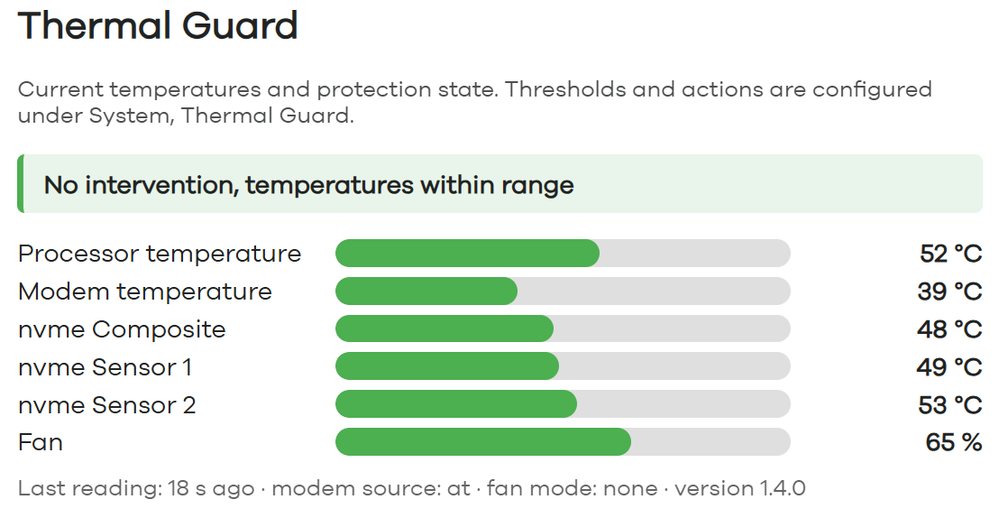
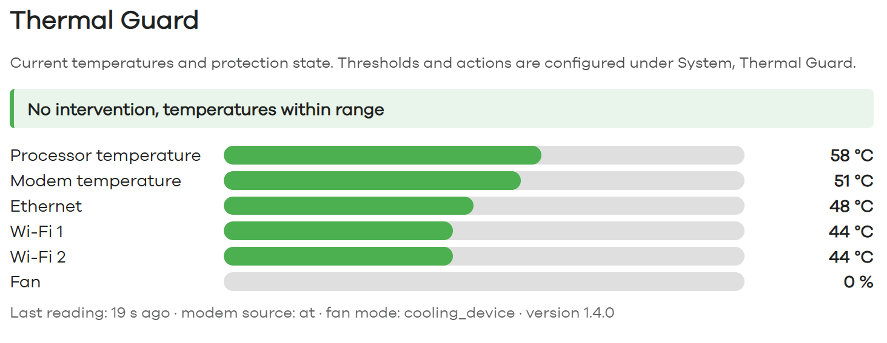
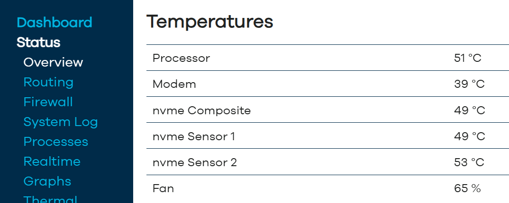
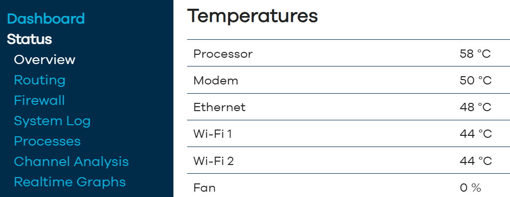
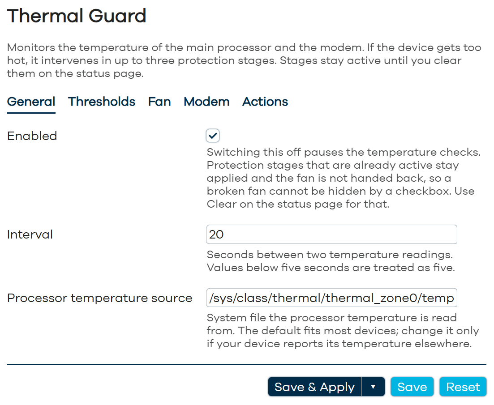
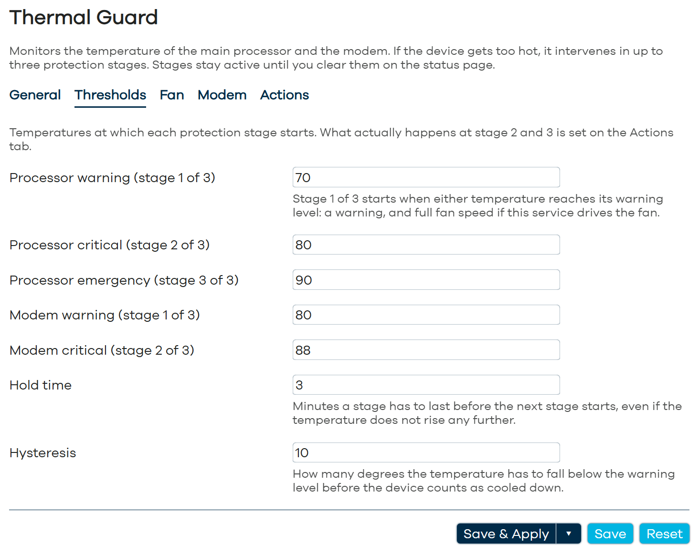
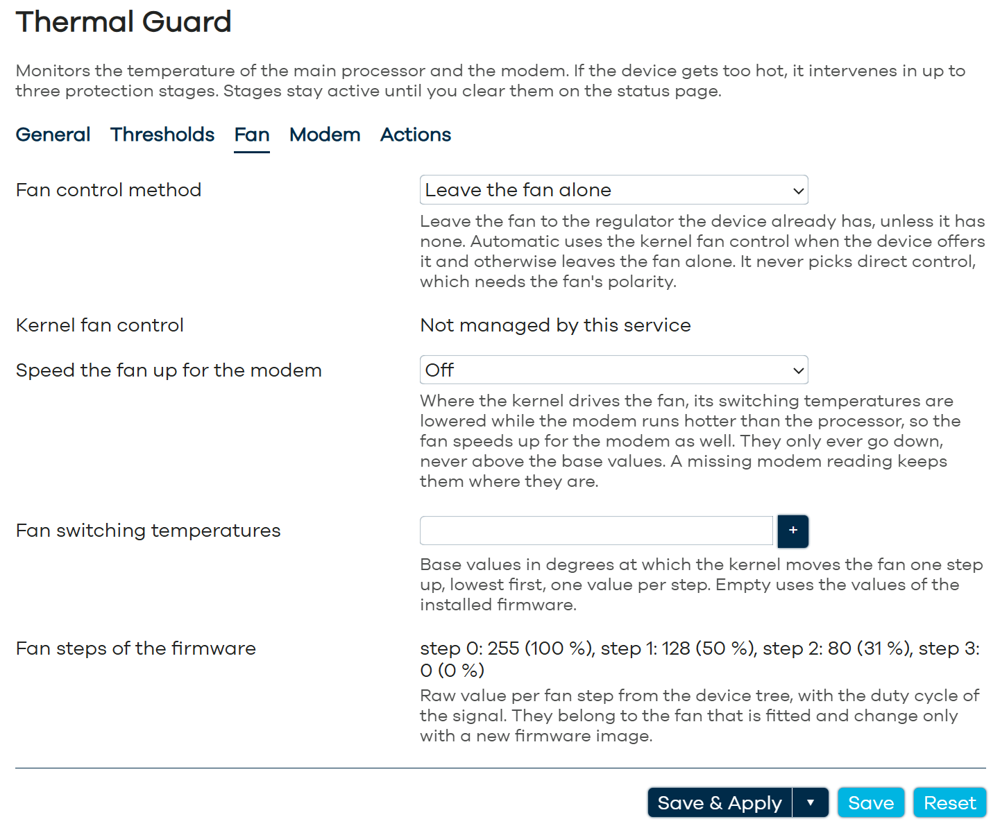
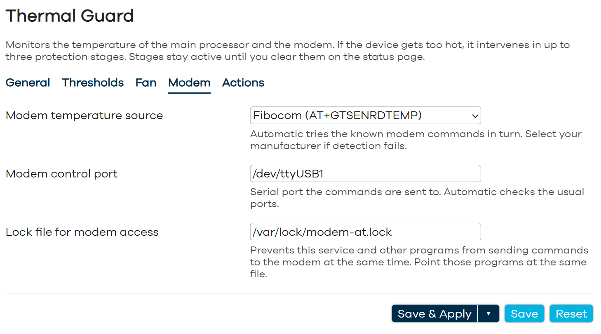
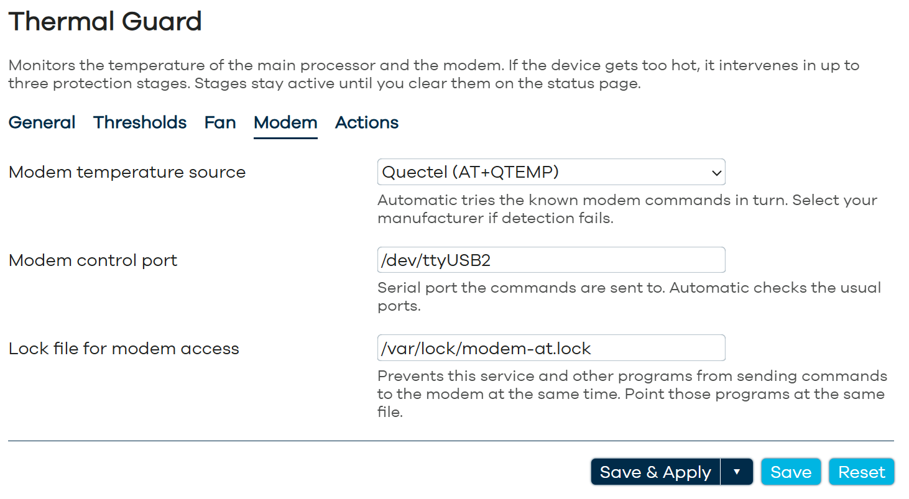
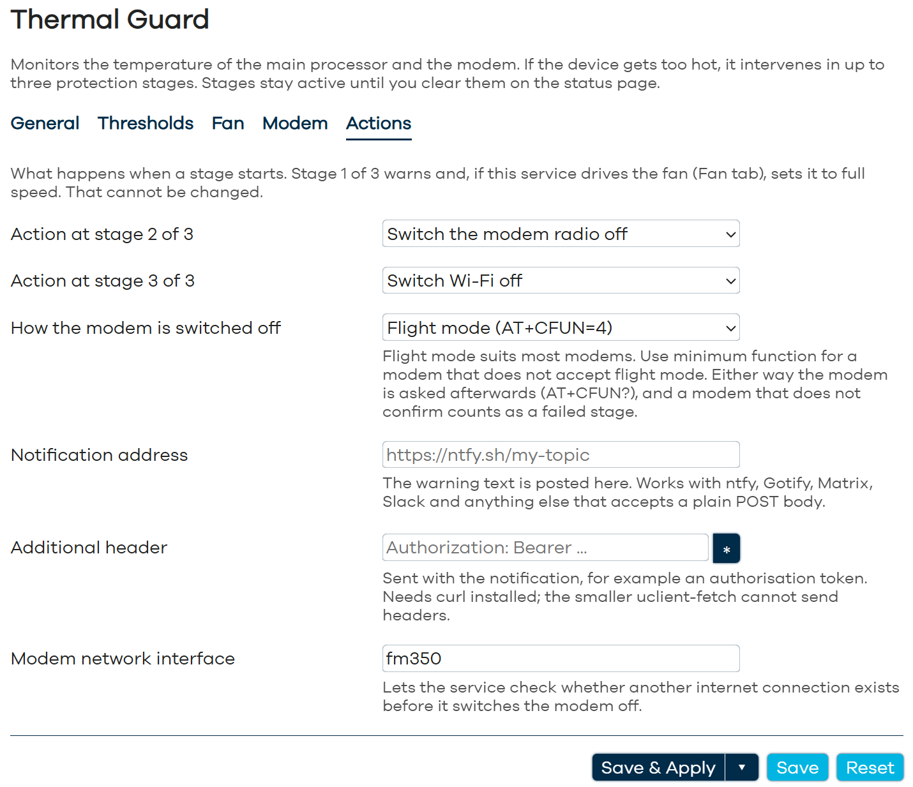

# thermal-guard

Overheating protection for OpenWrt routers with staged mitigation.



## Why this exists

The idea for this project came after a fan malfunction on my Banana Pi R3 Mini
damaged its Fibocom FM350-GL 5G module beyond repair. An inexpensive part
failed and took a much pricier one with it. Since one of my BPI R3 Minis runs
in a motorhome, I did not want to go through that again and set out to build
something that prevents it. This package is the result.

A better fan controller would not have helped: the one on the board was
convinced it had the fan at full speed. What was missing was something that
ignores what the fan is supposed to be doing and only looks at the temperature.

**This is not a fan controller.** OpenWrt has several of those and they do the
job better: they map temperature onto a curve and keep the box in its normal
band. This one does nothing at all until a threshold is crossed, and then does
something drastic that does not undo itself. Thermostat and thermal fuse, two
layers rather than two opinions.

So where a fan controller is already installed, leave it in charge: `fan_mode`
is `none` by default, and that is the regular configuration for such a board,
not a workaround. The built-in fan handling exists for boards that have nothing else,
and "force it to maximum" is a poor substitute for a curve. What this package
adds is the layer above: the one that assumes the controller can fail, or can
be wrong, and acts on the temperature rather than on what the fan reports.

A fan that stops is rarely noticed until something dies. `thermal-guard` watches
SoC and modem temperature and, when the box runs hot, escalates in three stages:

| Stage | Default action | Triggered by |
|---|---|---|
| 1 of 3 | Warning; fan forced to full speed where `fan_mode` lets the daemon drive it | `cpu_warn` or `modem_warn` reached |
| 2 of 3 | Modem radio off (`AT+CFUN=4`) | `cpu_crit`/`modem_crit`, or stage 1 held for `hold_minutes` without any drop |
| 3 of 3 | Wi-Fi off | `cpu_emergency`, or stage 2 held for `hold_minutes` while still climbing |

The web interface counts stages from one, the daemon and the status file count
them from zero, so stage 1 of 3 is `stage=0` in `thermal-guard status`. What
stages 2 and 3 do is configurable; the table shows the defaults. Each built in
action is read back rather than assumed: the modem is asked for its state
(`AT+CFUN?`), `interface_down` waits for netifd to report the interface down,
`wifi_off` waits for netifd to report no enabled radio up. An action that does not
confirm counts as failed, and the failure is notified. A `command` hook counts
by its exit code.

Three design decisions worth knowing before you deploy it:

* **Stages never roll back on their own.** Cooling down is reported once, the
  stage stays. A fan that failed once will fail again, and a silent recovery
  hides the fault. Clearing is an operator decision: `thermal-guard reset`.
* **A reboot does not clear them either.** A stage change is mirrored to
  `/etc/thermal-guard/state`, and the daemon reapplies it at startup. The box
  did not get a new fan while it was down, so coming back up with the modem
  enabled would just repeat the incident. The restore is logged and notified.
* **A crash leaves the fan running.** The daemon only hands the fan back on an
  explicit reset, so dying mid-incident is the safe direction.

If a restored stage ever locks you out, reach the box over a wired port or
serial and run `thermal-guard reset`. Only a device that reached a stage whose
action is `wifi_off` or `interface_down` (stage 3 of 3 with the defaults) comes
back from a reboot with that connection still off, and such a device has a fan
and a modem, so it has wired ports too.

Every transition needs two consecutive readings above the threshold, which keeps
sensor glitches from triggering anything. A missing reading never blocks an
escalation: at a threshold it simply does not count, on the hold path it counts
as no drop, so it never delays stage 2 of 3, and a reference missing at stage
entry is taken from the first reading after the gap.

Escalating from stage 1 of 3 on time alone, when the temperature has not dropped, is
the part that earns its keep. The guard never asks whether the fan turned; it
asks whether the box got cooler. That covers a fan that failed, a fan cable
that came off, and the case that prompted this package: a fan controller whose
pwm polarity was configured the wrong way round, which stopped the fan while
reporting that it had gone to full speed. No software can tell those apart on
a board without a tachometer, and none of them have to be told apart, because
the answer is the same. Set `hold_minutes` with that in mind: it is how long a
stage is given to prove it worked before the next one starts.

## Screenshots

The status page on two boards: a Banana Pi R3 Mini with a Fibocom modem, an NVMe
drive and the MediaTek vendor Wi-Fi driver, where another program drives the fan,
and a GL-iNet GL-X3000 with a Quectel modem, where the kernel does. Wi-Fi 1 and 2
come from `iwpriv` on the one and from hwmon on the other.

<table>
  <tr>
    <td></td>
    <td></td>
  </tr>
</table>

The same readings in a block on the LuCI overview page:

<table>
  <tr>
    <td></td>
    <td></td>
  </tr>
</table>

<details>
<summary>Configuration page, System → Thermal Guard</summary>

General



Thresholds for the three stages



Fan, including the switching temperatures of a kernel-driven fan



Modem, Fibocom on the Banana Pi and Quectel on the GL-X3000




Actions and notifications



</details>

## Install

```sh
opkg install thermal-guard luci-app-thermal-guard   # or: apk add ...
/etc/init.d/thermal-guard enable
/etc/init.d/thermal-guard start
```

Two LuCI pages: **Status → Thermal Guard** shows the temperatures, the fan and
the current stage, and clears the stages; **System → Thermal Guard** edits the
configuration. A changed option is picked up within one interval, and a
deleted one is back at its default by then, so Apply needs no restart.

The package depends on `coreutils-timeout`: every AT query runs under a time
limit, so a hung modem costs one reading instead of the whole loop. It also
depends on `jsonfilter` to read netifd's answers; `base-files` ships it on every
image anyway. Optional runtime helpers, none of them a hard dependency:
`sms_tool` for the modem AT commands, `flock` for the AT lock, `ip` for the
uplink check, and `curl` for notification headers. Without `flock` the AT
queries run without the lock; without `ip` the daemon cannot tell whether a
route exists and sends every message at once instead of queueing it. Each is
logged once as a warning.

## Configuration

`/etc/config/thermal-guard`, section `main`. Defaults leave the fan alone and
read a Quectel or Fibocom modem; driving the fan is an explicit choice.

| Option | Default | Meaning |
|---|---|---|
| `enabled` | `1` | Pauses the checks when `0`; stages and the fan stay until a reset |
| `interval` | `20` | Seconds between readings, minimum 5 |
| `cpu_warn` / `cpu_crit` / `cpu_emergency` | `70` / `80` / `90` | SoC thresholds in °C, must be ordered |
| `modem_warn` / `modem_crit` | `80` / `88` | Modem thresholds in °C |
| `hold_minutes` | `3` | How long a stage must persist before time alone escalates |
| `hysteresis` | `10` | Degrees below the warn thresholds that count as cooled down |
| `extra_sensors` | `1` | `0` hides the board's other sensors (Wi-Fi, ethernet phys, NVMe) from the status page |
| `cpu_temp_path` | `/sys/class/thermal/thermal_zone0/temp` | Sysfs source under `/sys/class/thermal/` or `/sys/class/hwmon/`, degrees or millidegrees. A sensor is looked for when this does not read |
| `fan_mode` | `none` | `cooling_device`, `pwm`, `auto`. `auto` takes the cooling device if there is one, otherwise it stays `none`; it never picks `pwm` |
| `fan_cooling_device_type` | `pwm-fan` | Type string used to find the cooling device |
| `fan_governor` | `step_wise` | Governor the zone is handed back to on reset when no earlier one was saved: `step_wise`, `fair_share`, `bang_bang` or `power_allocator`. Anything else, `user_space` included, means `step_wise`, and so does a governor the kernel was built without |
| `pwm_path`, `pwm_enable_path` | unset | `pwm` mode only; found by hwmon name when left empty |
| `pwm_full`, `pwm_idle` | unset | Raw values for fastest and slowest, both required for `pwm`. Without both the fan is left alone |
| `modem_source` | `auto` | `quectel`, `fibocom`, `file`, `command`, `none` |
| `modem_at_port` | `auto` | Serial port for AT commands |
| `modem_temp_file` | unset | Source for `file` mode; `command` mode reads the `modem-temp` hook |
| `at_lock` | `/var/lock/modem-at.lock` | Shared lock. Every other AT user on this port has to take the same one, see below |
| `trip_boost` | `off` | `modem` lowers the fan's trip points while the modem runs hotter than the CPU, see below |
| `trip_boost_offset` | `15` | Degrees the modem may run above the CPU before the trips go down, 0 to 40 |
| `trip_active` | unset | List, baseline of the fan's active trips in °C, ascending, one per trip. Unset means the device tree values |
| `stage1_action` / `stage2_action` | `modem_radio_off` / `wifi_off` | Also `interface_down`, `command`, which runs a hook, or `none` |
| `modem_radio_off_at` | `AT+CFUN=4` | Or `AT+CFUN=0` for a modem without flight mode. Nothing else is accepted |
| `action_interface` | unset | Interface `interface_down` takes down; `uplink_interface` when unset |
| `notify_url` | unset | The warning text is posted here |
| `notify_header` | unset | Extra header for the post, needs `curl` |
| `uplink_interface` | unset | Modem interface name, lets the daemon tell whether another uplink exists |

### Fan modes

`cooling_device` sets the cooling device to its maximum step, taking the thermal
zone off its governor first if one drives it. Prefer this mode wherever the
board offers it: `max_state` means maximum cooling whichever way the device tree
runs its `cooling-levels`, so this mode cannot get the polarity wrong.

On reset the zone gets back the governor it had before, or `fan_governor` when
none was recorded. A governor the running kernel does not list in the zone's
`available_policies` is replaced by `step_wise`. The policy is read back
afterwards: a zone that still reports another one is logged as `crit`, since
then nothing regulates the fan.

A cooling device that no thermal zone binds still works, there is simply nothing
to take over and nothing to hand back. Whether one is bound is worth knowing,
because it decides whether there is a kernel backstop underneath at all:

```sh
ls /sys/class/thermal/thermal_zone*/cdev* 2>/dev/null || echo "no zone drives any cooling device"
```

Where nothing is printed, the device tree defines no `cooling-maps`, the zone's
trip points fire into nothing, and the only regulation on the board is whatever
runs in userspace. That is worth fixing in the device tree, because it is the
difference between a fan controller that can fail safely and one whose failure
nobody catches until this package escalates.

`pwm` writes the duty cycle to sysfs directly. Use it on boards where the fan is
not wired into a thermal zone. Before taking the chip over, the daemon records
its mode and duty cycle. Reset writes the mode back, and the duty cycle where
the chip was in manual mode; in automatic mode the chip sets it itself. Nothing
has to be configured for the way out. Leaving `pwm_path` empty is fine: the fan chip is
looked up by its hwmon name, which survives the renumbering that happens when
another sensor appears.

Polarity is not something the daemon can work out, and getting it wrong stops
the fan in an emergency instead of speeding it up. Several boards, the Banana Pi
R3 Mini among them, run the signal inverted: `1` is full speed and `255` stops
the fan. So there is no default: `pwm` needs both `pwm_full` and `pwm_idle`, and
with either missing the daemon logs it once and leaves the fan alone. For the
same reason `auto` never resolves to `pwm`. Confirm the values by ear rather
than by reading the number.

If another service already controls the fan, keep `fan_mode` at `none`. Stage
1 of 3 is then a warning only. Setting a fan mode anyway works: the daemon notices when a value it wrote has been replaced, says so in the log and
reasserts, but two controllers writing one file is worth avoiding, and the
other one almost certainly has the better curve. Nothing is lost: the stage
that forces the fan is the one a working controller has already covered, and
the stages that matter come after it.

### Trip management

Where the kernel drives the fan through a thermal zone, it only compares the
CPU against the zone's trip points; a modem running hotter than the CPU does not
reach it. With `trip_boost 'modem'` the daemon lowers the zone's active trips by

```
delta = (modem - trip_boost_offset) - cpu, 0 if negative,
        rounded up to 5 K, at most 40 K
```

which is the same as regulating on `max(cpu, modem - offset)`, but leaves the
regulator in the kernel. The zone is the one whose `cdevN` points at the fan's
cooling device, the trips are the `active` ones bound to it, whatever their
numbers are. `hot` and `critical` are never written.

The trips only ever go below the baseline, never above it. A wrong modem reading
can therefore only make the fan louder, not slower. A missing reading keeps the
trips where they are, raising them again takes three cool readings in a row, and
not at all while a stage is in force. Stopping the daemon leaves them as they
are; setting `trip_boost 'off'` with `trip_active` unset hands the zone its
device tree values back once and leaves it alone from then on.

Nothing is written unless `trip_boost` or `trip_active` is set, so a board whose
fan the kernel already drives keeps its trips as they are.

A new firmware image can bring other trips in its device tree. The first cycle
with `trip_active` set records the device tree values of that boot in
`/etc/thermal-guard/trip_base`, which survives a sysupgrade. When a later boot
finds other values, the log says so, the status file carries
`trip_dt_changed=1`, and **System → Thermal Guard** offers to use the new values
or to keep your own. `trip_active` stays in force until you decide. Both
choices run `thermal-guard trips-keep`, which records the values of the running
boot. Without `trip_active` the file is neither read nor written.

### Sharing the modem with another program

A modem answers two overlapping AT conversations with nothing useful, and the
program that gets the nothing rarely says so. This daemon takes `at_lock` around
every query. **Anything else on the box that talks to the same port has to take
the same lock**, or both readings become unreliable. ModemManager cannot, see
the known limitations below.

That is not a theoretical concern. On a Banana Pi R3 Mini this package was
installed next to a fan controller that queried the modem without a lock. The
collisions garbled the controller's modem reading, its control temperature
collapsed, and it set the fan to its minimum while the board sat at 68 °C.
Nothing in either program reported a fault: the fan controller believed it was
regulating correctly, and this daemon believed the fan was somebody else's
business. The symptom appeared at the fan, the cause was at the serial port.

If the other program cannot be changed, give it the modem and set
`modem_source` to `none` here, but understand the cost. A modem die runs
appreciably hotter than the SoC, commonly by 10 to 20 K, so protecting it
through the processor thresholds alone means acting late for the part that is
actually at risk. Prefer fixing the lock.

Programs that only need the temperature do not have to ask the modem at all.
After every good reading the daemon writes one line to
`/var/run/thermal-guard/modem-temp`:

```
47 1790150400 at
```

degrees, Unix time of the reading, source (`at`, `file` or `command`). The file
is replaced atomically and not touched when a reading fails, so a reader that
finds it older than three intervals should treat the value as unknown.

### Notifications

Set `notify_url` and the message is posted there as the request body. That
covers ntfy, Gotify, Matrix, Slack and most other things you would want to be
woken by, and it needs no shell command in the configuration to do it.

```
option notify_url 'https://ntfy.sh/my-topic'
```

`curl` is used when it is installed, otherwise `uclient-fetch` from the OpenWrt
base, or `wget`. Only `curl` can send `notify_header`, and only `curl` reads the
address and the header from a file (mode 600) instead of the command line, where
`/proc` shows them to every local process.

Without `curl` the daemon therefore refuses an address that carries a query
string or user info (`?token=...`, `user:pass@host`). It logs the reason once
and sends nothing over HTTP; the notify hook below still works. A secret in the
path of the address, as in Slack or Discord webhooks or a private ntfy topic,
cannot be told apart from an ordinary path and is sent as it is. Without `curl`
it is visible in the process list while the message goes out. Install `curl`
for such services.

For a delivery HTTP cannot express, put an executable at
`/etc/thermal-guard/hooks/notify`; it gets the text on stdin. With both set,
the URL is tried first and the hook is the fallback.

From stage 2 of 3 on the daemon checks whether a route exists that does not run
through the modem; if not, the message is queued and retried, because that
stage is about to switch the modem off.

### Hooks

`/etc/thermal-guard/hooks/` holds executables the daemon runs for `notify`,
for `stage1` and `stage2` when the action is `command`, and for `modem-temp`
when `modem_source` is `command`. See the `README` installed in that directory.
The whole of `/etc/thermal-guard/` is listed in `/lib/upgrade/keep.d/`, so
hooks and any files they need, persisted stages and `trip_base` survive a
`sysupgrade`.

Every hook runs under a time limit: 15 s for `notify`, `stage1` and `stage2`,
5 s for `modem-temp`, which runs every cycle. A hook still running then gets
TERM, and KILL 5 s later, and counts as failed.

They are files rather than options because the rpcd ACL that lets the web
interface edit this configuration does not grant write or execute access to
that directory. Custom code therefore has to be put there by someone with
shell access, and editing the configuration cannot introduce any.

## Commands

```sh
thermal-guard status            # current stage, readings, fan state
thermal-guard reset             # clear all stages, hand the fan back, radio on
thermal-guard trips-keep        # record this boot's device tree trips in trip_base
thermal-guard test 85 70        # two cycles with these readings, print what they would trigger, change nothing
thermal-guard selftest          # run the decision logic against its test cases
```

`test` runs its two cycles at the same moment, because every stage needs two
readings in a row. The hold time does not pass in between: from an idle state,
stage 3 of 3 shows only through `cpu_emergency`, and the escalation over time
cannot be tried this way. `test 75 66` staying at stage 1 of 3 says nothing
about it. On a box already in a stage, its hold timers apply.

`/var/run/thermal-guard.status` holds a machine readable snapshot. Everything
else reads that file, so only the daemon talks to the modem, and `thermal-guard
reset`, which switches the radio back on under `at_lock`.

## Where the readings show up

* **Status -> Thermal Guard** is the monitor page: temperatures, fan state, stage.
* **Status -> Overview** gets a short temperature block, installed with the LuCI app.
* **Syslog**, tag `thermal-guard`, facility `daemon`: `crit` for a stage, a
  restored stage, a stage that cannot be persisted and every stage action that
  failed, the way back after a reset included; `warning` for a rejected option,
  a missing tool, a sensor that does not read and trips that could not be
  written; `notice` for cooled down, reset, `trips-keep` and new firmware trips
  that need a decision; `info` for the rest. `logread -e thermal-guard` shows
  them all, a remote syslog can filter on the priority. The event log in
  `/var/run/thermal-guard/log` keeps the same lines without it.
* **Other sensors** of the board (`extra_sensors`, on by default): every hwmon and
  thermal zone temperature besides the processor, such as Wi-Fi chips, ethernet
  phys and NVMe drives. The proprietary MediaTek Wi-Fi driver `mt_wifi` exposes
  none of those; its radios are read with `iwpriv <interface> stat` instead, the
  way ImmortalWrt's own overview does it, and only while the interface is up.
  These readings are shown only, they never trigger a stage.
* **RRD graphs** through collectd. The package ships an exec plugin feed, enable it
  in `/etc/collectd.conf`:

  ```
  LoadPlugin exec
  <Plugin exec>
      Exec "nobody:nogroup" "/usr/libexec/thermal-guard-collectd"
  </Plugin>
  ```

  Needs `collectd-mod-exec` and `collectd-mod-rrdtool`. It emits
  `temperature-soc`, `temperature-modem`, `gauge-fan_step` and `gauge-stage`
  under the plugin name `thermal_guard`.

## Hardware

Developed against two boards, which is where the two fan modes come from:

| Board | Fan | Modem |
|---|---|---|
| GL.iNet GL-X3000 (MT7981) | kernel thermal zone, `cooling_device` | Quectel RM520N-GL |
| Banana Pi R3 Mini (MT7986) | sysfs PWM, `pwm` | Fibocom FM350-GL |

Nothing in the package is board specific, any OpenWrt device with a readable
thermal zone should work.

## Known limitations

**ModemManager does not know `at_lock`.** It keeps the modem's AT ports open
and sends its own commands without taking the lock this daemon uses. The daemon
cannot detect that. Where ModemManager manages the modem, read the temperature
another way (`modem_source` `file` or `command`) or set it to `none`; the
section on sharing the modem says what `none` costs.

**Without `curl`, notifications are limited.** `uclient-fetch` and `wget` cannot
send `notify_header`. The message goes out without it, a webhook that needs it
refuses the message, and it stays in the outbox, retried every two minutes.
Both tools also take the address on their command line, where `/proc` shows it
to every local process while the message goes out. An address with a query
string or user info is refused for that reason and logged once; a secret in the
path of the address cannot be told apart and is sent as it is.

**A board that reports no temperature gets no processor protection.** When
neither a thermal zone nor a hwmon sensor can be read, the daemon logs `this
device reports no temperature at all, nothing to watch here` once and the
status page says so. No stage can start from the processor side. The modem
thresholds still apply as long as the modem gives a reading.

**`wifi_off` sees only what netifd manages.** The action runs `wifi down` and
confirms it through `ubus call network.wireless status`. Radios that netifd
does not manage are neither switched by `wifi` nor seen by the check. When
netifd lists no radio, the action fails and is notified, and the daemon warns
once when it loads a configuration that uses `wifi_off`. When netifd does not
answer, the action fails as well.

**Two cooling devices of the same type cannot be told apart.** The daemon
takes the first one of `fan_cooling_device_type` whose `max_state` is above 0.
If your board has such a setup, please report it.

## License

GPL-2.0-only. The escalation logic started out as a device specific script for
the two boards above and was generalised for this package.
